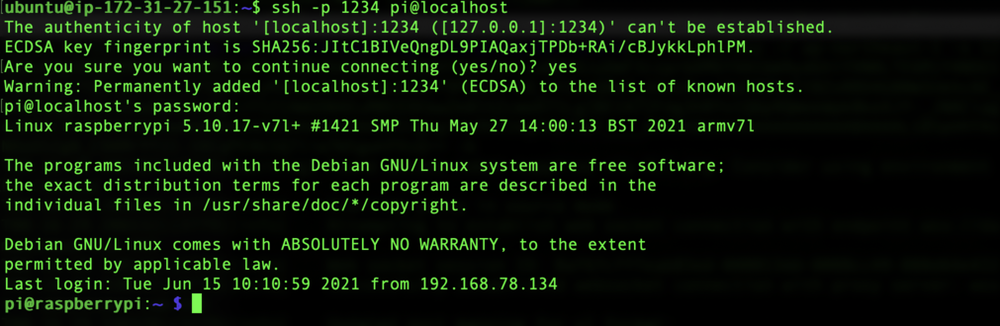

# AWS IoT Secure Tunneling with Trusted Platform Module

This project demonstrate how to use AWS IoT Secure Tunneling with a Trusted Platform Module (TPM).  We use the Infineon OPTIGA TPM SLI 9670 installed on a Raspberry Pi as the example hardware platform.


### Setting up the TPM on Raspberry Pi 3/4

------

The Infineon OPTIGA SLI 9670 TPM uses the SPI interface to connect to the Raspberry Pi on the GPIO Pins. The assembly looks like the picture below.  Either Raspberry Pi 3 or 4 works.


- Install Raspbian OS on Raspberry Pi.  Connect to the console via SSH or UART.  Follow step 1 to 8 of this [documentation](https://docs.aws.amazon.com/greengrass/v1/developerguide/setup-filter.rpi.html).
- Connect the Raspberry Pi to Internet.


##### Configure the TPM

1. Login to Raspberry Pi, update the system:

   ```bash
   sudo apt-get update
   sudo apt-get upgrade
   ```

2. Edit /boot/config.txt and add the following line:

   ```tex
   dtoverlay=tpm-slb9670
   ```

3. Reboot your Raspberry Pi.  Make sure the TPM module is recognized using the following command:

   ```bash
   ls -al /dev/tpm*
   ```

   The output should look like this:

   

4. Test the TPM with an utility, `eltt2`, provided by Infineon and available on [Github](https://github.com/Infineon/amazon-greengrass-hsi-optiga-tpm#check-tpm-functionality-with-eltt2). Follow these steps to build eltt2:

   ```bash
   mkdir ~/tpm
   git clone  https://github.com/infineon/eltt2
   cd eltt2
   make -j$(nproc)
   sudo ./eltt2 -g
   ```

   The output should look like this:

   


##### Installation TPM software

1. Install the required tools for building TPM software.

   ```bash
   sudo apt-get install cmake build-essential libssl-dev unzip autoconf libtool automake pkg-config m4 autoconf-archive libjson-c-dev libcurl4-openssl-dev uuid-dev
   ```

2. Build and install TPM TSS.

   ```shell
   cd ~/tpm
   git clone https://github.com/tpm2-software/tpm2-tss.git
   cd tpm2-tss
   git checkout 3.0.1
   ./bootstrap
   ./configure
   make -j$(nproc)
   sudo make install
   sudo ldconfig
   ```

3. Build and install TPM Tools.

   ```shell
   cd ~/tpm
   git clone https://github.com/tpm2-software/tpm2-tools.git
   cd tpm2-tools
   git checkout 4.2.1
   ./bootstrap
   ./configure
   make -j$(nproc)
   sudo make install
   sudo ldconfig
   ```

4. Build and install TPM OpenSSL Engine.

   ```shell
   cd ~/tpm
   git clone https://github.com/tpm2-software/tpm2-tss-engine.git
   cd tpm2-tss-engine
   git checkout v1.1.0
   ./bootstrap
   ./configure
   make -j$(nproc)
   sudo make install
   sudo ldconfig
   ```

5. Check the functionality of TPM software.

   ```bash
   sudo chmod a+rw /dev/tpm*
   openssl engine -t -c tpm2tss
   ```

   The output should look like this:

   

6. Check by generating a random data.

   ```bash
   openssl rand -engine tpm2tss -hex 10
   ```

   The output should look like this:

   


### AWS IoT Secure Tunneling

------

AWS IoT Secure Tunneling helps customers establish bidirectional communication to remote devices over a secure connection that is managed by AWS IoT. Customers need to create a secure tunneling request from AWS IoT console or AWS CLI to inform the remote devices using AWS IoT’s MQTT connection. In this project, we will use a subscribe/publish sample app from the AWS IoT Device SDK for Embedded C to demonstrate the flow of AWS IoT Secure Tunneling.

By default, the AWS IoT Device SDK for Embedded C use TLS 1.2 to establish secure connection with AWS IoT Core.  A X.509 certificate and a private key are required for establishing the TLS connection.

In this session, we demonstrate how to provision a TPM-generated private key into TPM and register a certificate to AWS IoT Core. With the sample code, the Raspberry Pi can connect to AWS IoT Core using the private key secured by the TPM.


##### Prerequisites

- AWS Command Line Interface(CLI) installed on a remote laptop/desktop. Follow instructions [here](https://docs.aws.amazon.com/cli/latest/userguide/cli-chap-welcome.html).
- An AWS account with AWS IoT Core service permission. More details about AWS IoT Permission can be found [here](https://docs.aws.amazon.com/iot/latest/developerguide/security-iam.html).
- TPM tools for creating and provisioning private key.
- AWS IoT Local Proxy agent running on both the Raspberry Pi and a PC.  The PC is where you use secure tunneling to connect to the Raspberry Pi. More details about AWS IoT Local Proxy can be found[here](https://github.com/aws-samples/aws-iot-securetunneling-localproxy).


##### Create and Provision the Private key using the TPM

1. Login to the Raspberry Pi. Use the following commands to create and provision the private key into TPM:

   ```bash
   mkdir ~/tpm/certs
   cd ~/tpm/certs
   #Primary key handle id and child key handle id
   HANDLE_PRIKEY=0x81000001
   HANDLE_CHILDKEY=0x81000002

   #Initializaztion
   tpm2_startup -c
   tpm2_clear -c p
   tpm2_changeauth -c o owner123
   tpm2_changeauth -c e endorsement123
   tpm2_changeauth -c l lockout123

   #For development stage only
   tpm2_dictionarylockout -s -n 1000000 -t 0 -l 0 -p lockout123

   #Create Primary key, ECC format
   tpm2_createprimary -C o -g sha256 -G ecc -c primary.ctx -p pri123 -P owner123
   tpm2_evictcontrol -C o -c primary.ctx $HANDLE_PRIKEY -P owner123
   #Create Child key, ECC format
   tpm2_create -C $HANDLE_PRIKEY -g sha256 -G ecc -u child.pub -r child.priv -P pri123 -a "fixedtpm|fixedparent|sensitivedataorigin|userwithauth|decrypt|sign|noda"
   tpm2_load -C $HANDLE_PRIKEY -u child.pub -r child.priv -c child.ctx -P pri123
   tpm2_evictcontrol -C o -c child.ctx $HANDLE_CHILDKEY -P owner123
   #Check handle id status
   tpm2_getcap handles-persistent
   #Delete temporary file
   rm -f *.ctx *.priv *.pub 2> /dev/null
   ```

2. Use the following commands to create a CSR file from the TPM:

   ```bash
   cd ~/tpm/certs
   openssl req -new -keyform engine -engine tpm2tss -subj /CN=tpmtest/O=HOME/C=US -key $HANDLE_CHILDKEY -out tpm.pem.csr
   ```


##### Create Device Certificate and Register to AWS IoT Core

1. Install AWS CLI on the PC. You can check the AWS CLI configuration by:

   ```bash
   aws configure list
   ```

   The output should look like:

   

2. Download the CSR file created in Raspberry Pi to the PC, using the command:

   ```bash
   ##Note: use your Raspberry Pi user name and IP address to download
   scp pi@your_RPi_adrress:~/tpm/certs/tpm.pem.csr .
   ```

3. Create a thing and create a certificate from the CSR file:

   ```bash
   #Note that: both CUSTOM_THING_NAME and CUSTOM_POLICY_NAME are configurable
   thingname=CUSTOM_THING_NAME
   policyname=CUSTOM_POLICY_NAME

   #Create a thing
   aws iot create-thing --thing-name $thingname

   #Create a policy. Note: the sample policy document allows all resources and all actions on AWS IoT Core. For security concern, you should modify the policy.
   aws iot create-policy --policy-name $policyname --policy-document file://policy.json

   #Create certificate from the downloaded CSR file and set it as active and save it as a local file
   aws iot create-certificate-from-csr --certificate-signing-request file://tpm.pem.csr --set-as-active --certificate-pem-outfile tpm.pem.crt
   ```

  The output should look like:

   

   Please copy the content of certificateArn.  This is the name of the AWS resource that you will use later.

4.  Attach the certificate to the thing name and attach the policy the policy to the certificate using the commands:

   ```bash
   #Note: cerificateArn is the value from step 3.
   aws iot attach-thing-principal --thing-name $thingname --principal certificateArn
   aws iot attach-policy --policy-name $policyname --target certificateArn

   #Check your thing
   aws iot describe-thing --thing-name $thingname
   ```

   The output should look like:

   

5. Copy the generated certificate to the Raspberry Pi using the command:

   ```bash
   #Note: use your Raspberry Pi user name and IP address to upload
   scp tpm.pem.crt pi@your_RPi_address:~/tpm/certs/
   ```


##### Download AWS IoT Device SDK for Embedded C, apply Patch

1. Download from github. Patch the file provided by Infineon.

   ```bash
   cd ~/
   git clone https://aws-samples/integrate-aws-iot-secure-tunneling-with-trusted-platform-module.git
   cd ~/AwsIotDevSdkEmbeddedCWithTpm
   git clone https://github.com/aws/aws-iot-device-sdk-embedded-C.git
   cd aws-iot-device-sdk-embedded-C/
   #Checkout to tag: v3.1.5
   git checkout v3.1.5
   #Checkout the openssl wrapper from v1.1.2
   git checkout v1.1.2 -- aws_iot_src/protocol/mqtt/aws_iot_embedded_client_wrapper/platform_linux/openssl
   #Move the openssl wrapper to the platform/linux
   git mv aws_iot_src/protocol/mqtt/aws_iot_embedded_client_wrapper/platform_linux/openssl platform/linux/
   #Delete the unused folder
   rm -rf aws_iot_src
   #Patch the openssl wrapper to use TPM engine
   git apply aws-iot-tpm.patch
   ```

2. Replace the AWS IoT Secure Tunneling sample code by the new sample code from this project, and build.

   ```bash
   cp -rf ../subscribe_publish_sample ./samples/linux/
   cd ./samples/linux/subscribe_publish_sample
   make
   ```
3. Build and install the AWS Local Proxy to the default path. Follow instructions [here](https://github.com/aws-samples/aws-iot-securetunneling-localproxy).

   ```shell
   #After building localproxy, copy it to /usr/bin/
   cd path/to/localproxy/bin/
   sudo cp localproxy /usr/bin
   ```

4. Test the code using the command:

   ```bash
   #Note: all parameters are required. In this document, both the AWS root CA and device certificate would be downloaded to ~/tpm/certs. You can specify the path storing those certificate and CA. Port must be specified to 8883 and the HANDLE_CHILDKEY would be also customized. In this document, HANDLE_CHILDKEY would be 0x81000002.
   ./subscribe_publish_sample -h AWS_IOT_ENDPOINT -p 8883 -c path/to/your/device/tpm.pem.crt -r path/to/aws/root/ca/root.ca.pem -k HANDLE_CHILDKEY -t IOT_THING_NAME
   ```

   The AWS_IOT_ENDPOINT can be found on your AWS IoT Console under `Settings`:

   

   After executing the command, the output should look like:

   


5. The default ssh port number serving localporxy is 1234. You must makes sure that you allow the local connection via ssh through port 1234. If you want to change the ssh port number, please modify the file subscribe_publish_sample.c and specify the desired number follows by "-d".

   ```c
   //Line 132
   snprintf(cmd, COMMAND_LINE_MAX, "localproxy -r %s -d 1234 -t %s", cRegion, cToken);
   ```

6. This sameple code is using single thread to demonstrate the AWS IoT Secure Tunneling. If you want to establish multiple secure tunnels, please integrate this sample code to multiple threads to handle the requests.

##### Create a AWS IoT Secure Tunnel from AWS IoT Core Console

1. Login to your AWS IoT console, click `Manage`→`Tunnel`.

   

2. Click `Add new service` and give a name. In the `Thing name - optional`, choose the thing name you've created in the previous step.

   

3. Give a desired timeout, or use the default (12 hours). Make sure the Raspberry Pi is running the sample app, then click `Create tunnel`.

   

4. Download at least the Access token for source.

   

5. When the channel is created, on Raspberry Pi, the console should output messages like:

   


##### Test AWS IoT Secure Tunneling from the PC

1. Build the AWS Local Proxy in a Linux PC.  Follow instructions [here](https://github.com/aws-samples/aws-iot-securetunneling-localproxy).

2. Run the AWS Local Proxy:

   ```shell
   cd path/to/localproxy/bin/
   # Please replace AWS_REGION to your select region. PORT will be the desired local ssh port for serving AWS IoT Secure Tunneling. SOURCE_ACCESS_TOKEN could be found in file you've downloaded from the previous step.
   ./localproxy -r AWS_REGION -s PORT -t SOURCE_ACCESS_TOKEN -k
   ```

   The output should look like:

   

3. Open another terminal, log in to the Raspberry Pi using the commands:

   ```shell
   ssh -p 1234 pi@localhost
   ```

   The output should look like:

   

4. If you see error messages like below, please make sure your ssh daemon is allowed to listen on the customized port.

   


### License

------

This library is licensed under the [Apache 2.0 License](./LICENSE).


